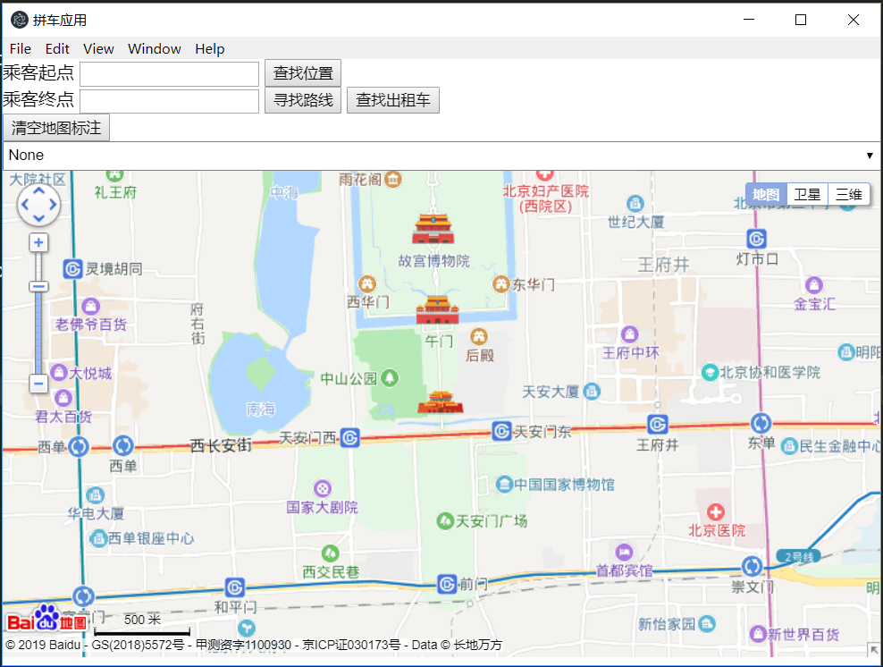
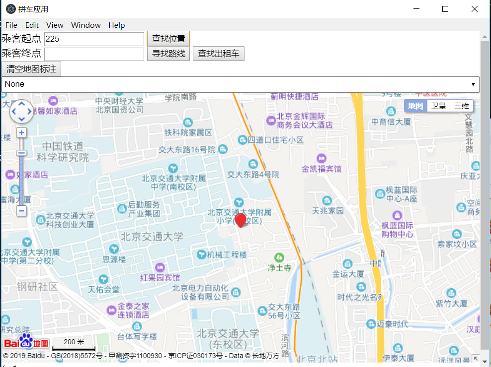
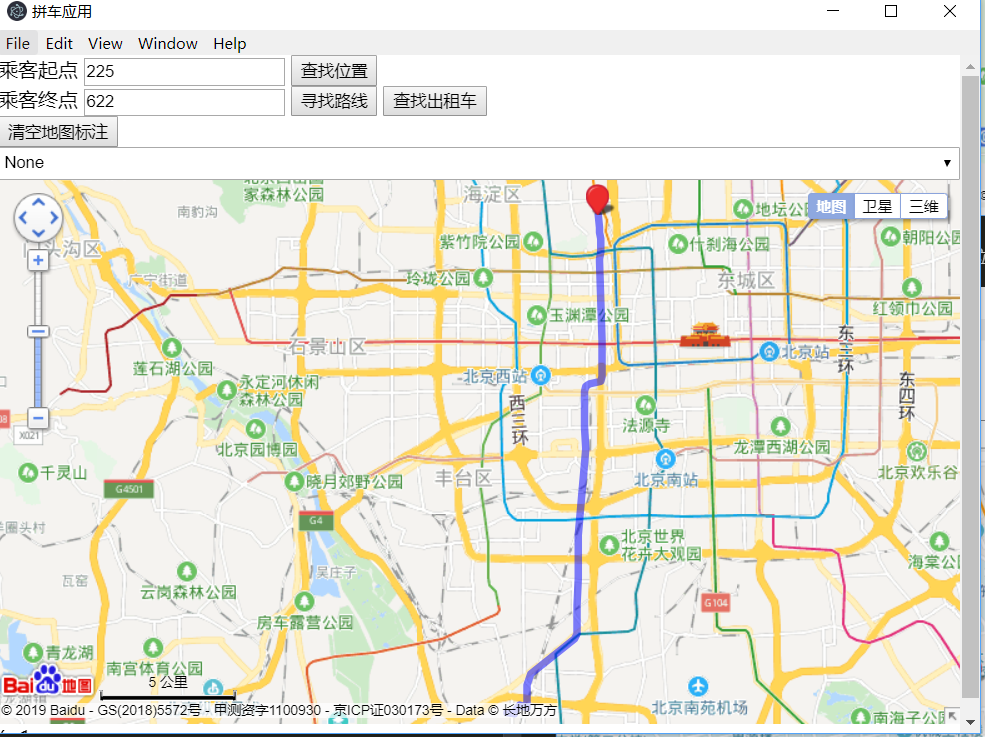
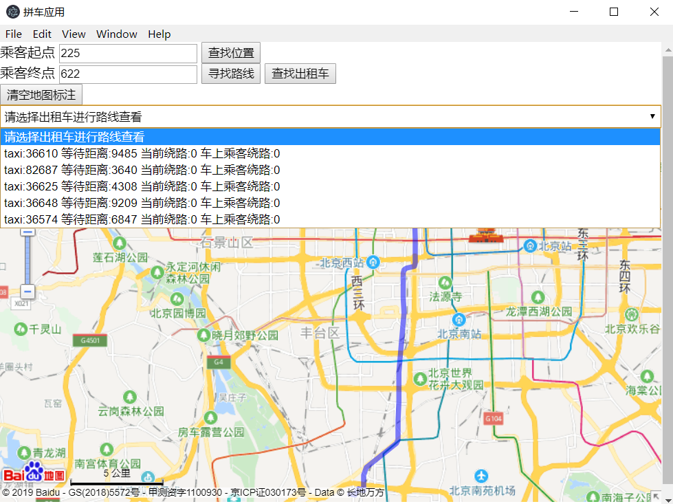
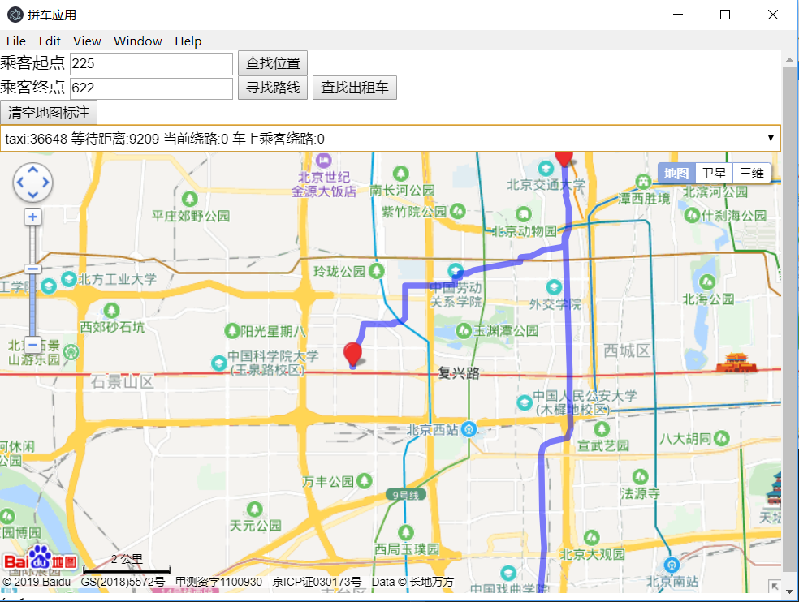

# 互联网出行大作业

计65 王元炜 2016011383

## 编译与运行

整个程序框架分为前后端两部分，后端负责数据的处理而前端负责与用户交互和显示路线。其中给出的数据全部原样存储在`backend/data`文件目录下。

### 后端的编译与运行

后端需要运行在linux或者WSL环境下（需要使用linux的网络库）进行编译，在backend文件夹下直接执行

```bash
make
```

即可编译，执行

```
./main
```

即可运行，如果出现以下输出，说明后端运行正常。可以进行前端的运行。

```
Edges Read Finished!
graph build finshed!
Process Finished!
Bind Success!
Listening...!
```

### 前端的编译与运行

前端需要nodejs和electron进行编译和运行。在frontend文件下执行

```bash
npm install
npm start
```

即可。后端的控制台输出connected!则表明成功。

### 前端操作说明

+ 成功启动之后，初始界面如下。



+ 在乘客起点的位置输入节点编号，可以点击查找位置，查找起点编号对应地图上的位置。



+ 输入起始位置，和终止位置，可以查找两点之间的最短路径。



+ 点击查找出租车可以查询到五辆符合要求的出租车，（一般不超过0.5s）即可返回结果。然后在下拉框里面可以看出租车的等待属性和绕路属性。



+ 在下拉框中选择一辆出租车，可以查看具体路线。



+ 地图可以改变比例尺，自动拖动，并且通过将鼠标悬停在浮标上可以查看这个点的属性和出租车的路线建议。

## 设计报告

### 候选车整体算法

首先对于所有的出租车，按照乘客数从小到大进行排序。也就是说优先考虑空车，再考虑只有一个乘客的车，之后考虑有两个和三个乘客的车。由于是无向图，所以从起点和终点各进行一次堆优化的Dijkstra算法，找到起点和到每个点和每个点到终点的最短距离。然后对于出租车的乘客数进行分情况讨论。搜到5辆车之后算法结束，直接返回候选车列表。

#### 空车

如果空车所在的位置距离起点小于等于10km,则自然是一个候选项，因为空车的车上乘客绕路距离和等待乘客绕路距离均为0。判断复杂度 $O(1)$

#### 有一个乘客的车

由于要求给出的是绕路距离小于等于10km而不是要求精确算出绕路距离，我们假设车上的这个乘客到目的地的距离就是经纬度算出的直线距离。枚举接上当前乘客之后的，先送当前乘客，再送车上乘客和先送车上乘客再送当前乘客两种方案，如果有其中一个绕路距离都小于等于给定阈值，则加入候选。 判断复杂度$O(1)$

#### 有两个和三个乘客的车

同样基于绕路距离小于等于10km，对于当前出租车，使用经纬度距离找到一条所有乘客都送完最短的路线，作为基准。在不改变顺序的情况下,看看当前乘客在哪个乘客之后送可以满足绕路距离，若存在一个位置符合，作为候选车返回。判断复杂度$O(1)$

#### 有四个乘客的车

这些车不可能成为候选车，如果算法进行到这里还没有结束则报错。事实上，在进行算法设计之后，我对于所有起始点进行了验证发现对于任意一对起始点和终点，空车和一个乘客的车加起来肯定可以满足要求。所以对于任何一对点对查询，算法可以再$O(nlog(nm)+k)$的时间复杂度内解决，其中n是节点数，m是边数，k是出租车数量。

### 寻路算法

采用堆优化的朴素A*算法在两点之间进行寻路。最坏时间复杂度$O(nlogn)$

## 第三方库

使用百度地图api和electron第三方库，使用linux下的socket通讯库。

## github

大作业检查之后将github的仓库设置为public。

[Github仓库](https://github.com/davidwangd/TaxiRouter)
